# AI Provider 缓存池 - 系统流程图

## 1. 应用启动流程

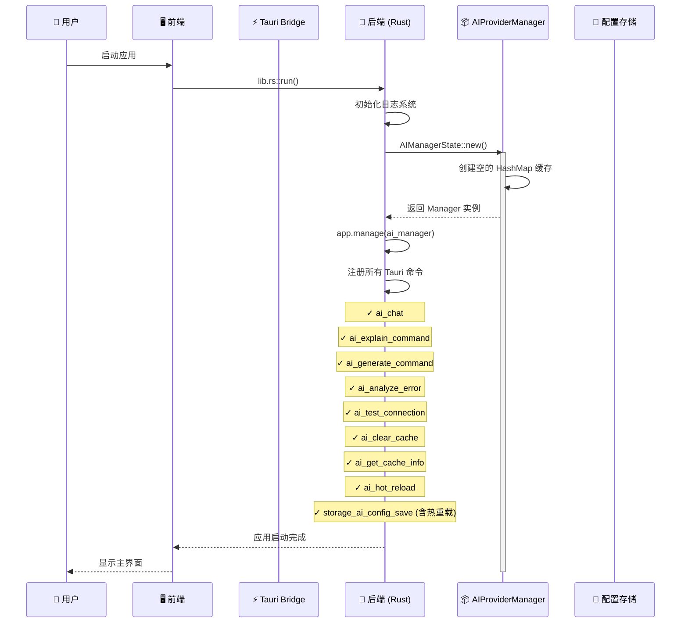

---

## 2. 首次 AI Chat 请求（缓存未命中）

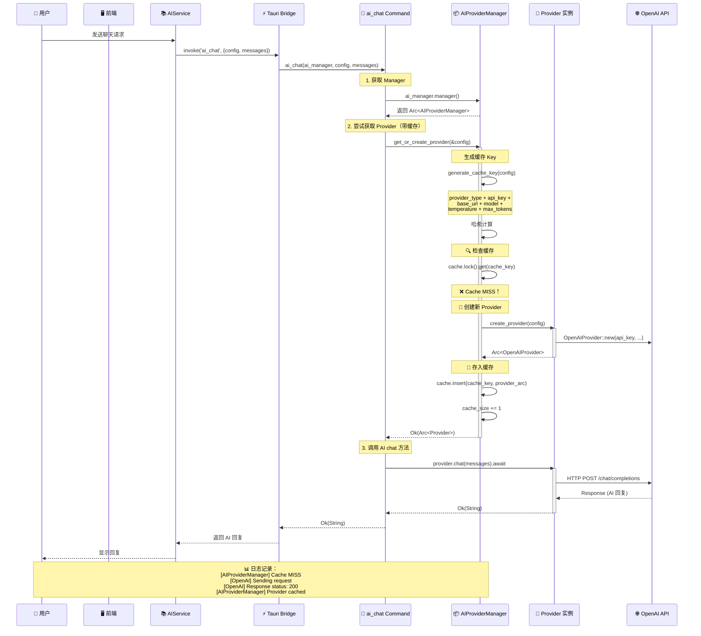

---

## 3. 再次 AI Chat 请求（缓存命中）

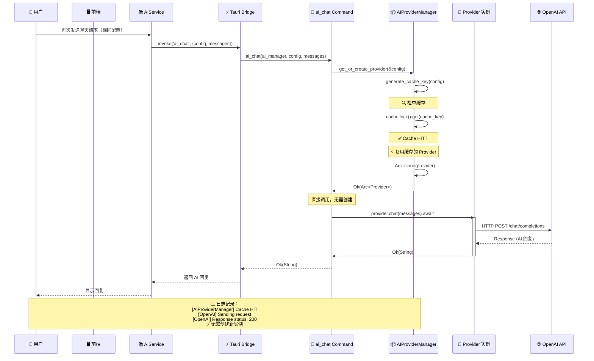

---

## 4. 修改配置并保存（自动热重载）

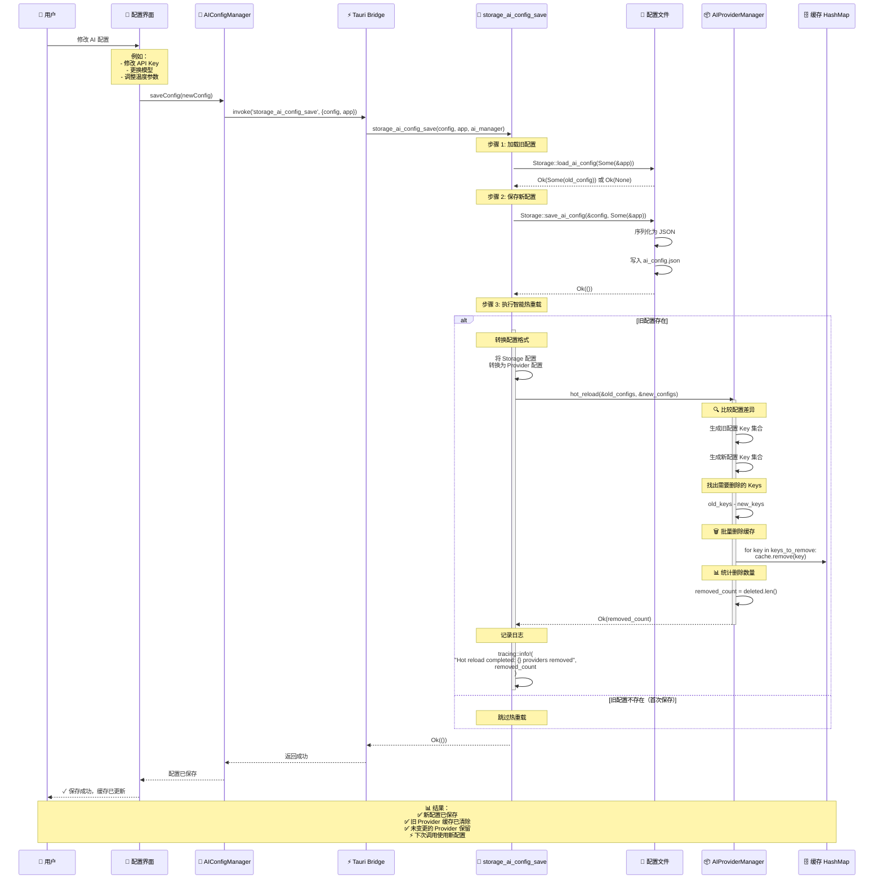

---

## 5. 手动清除缓存

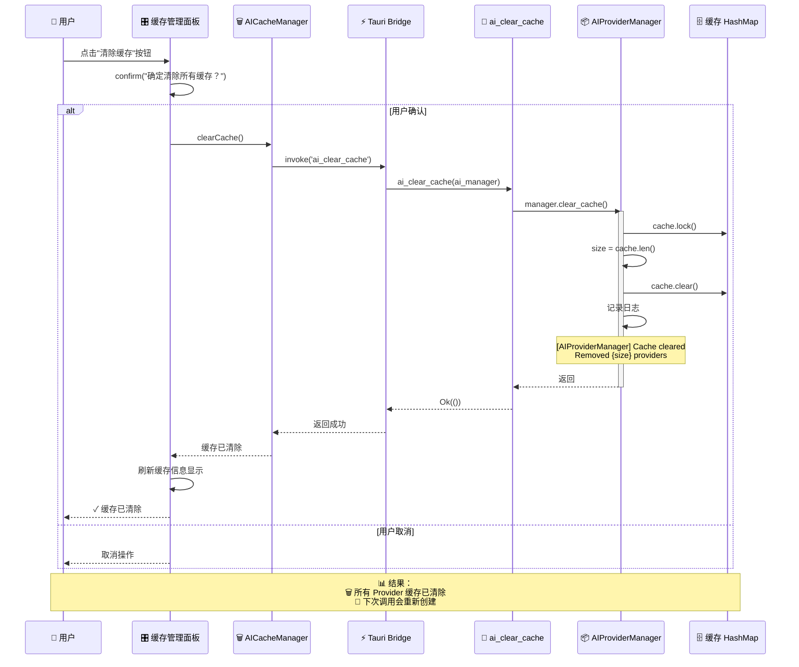

---

## 6. 查看缓存信息

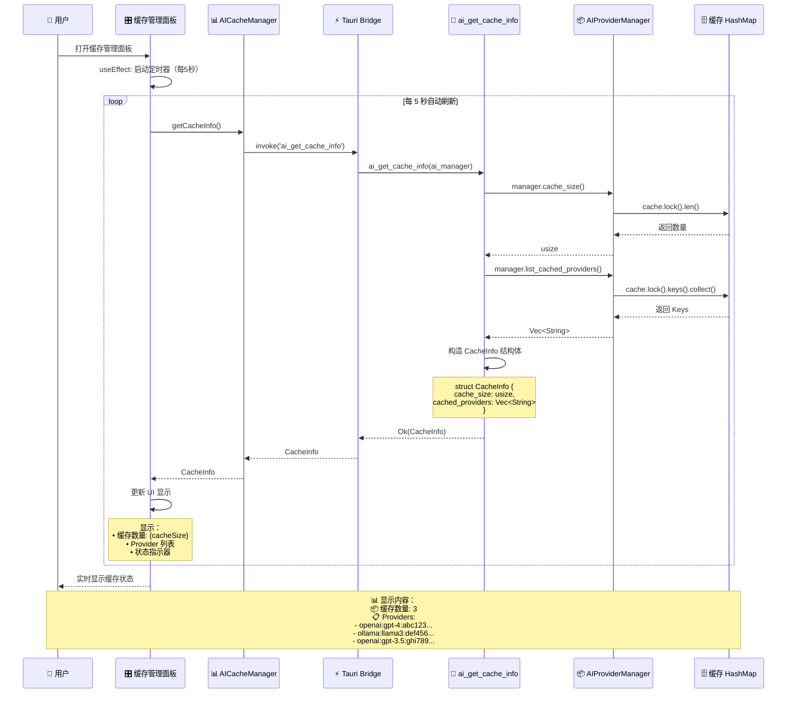

---

## 7. 手动触发热重载

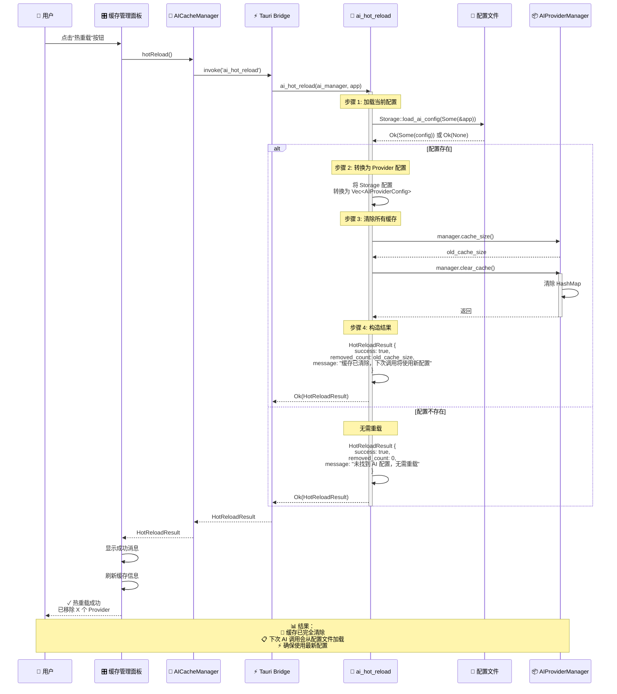

---

## 8. 测试 AI 连接

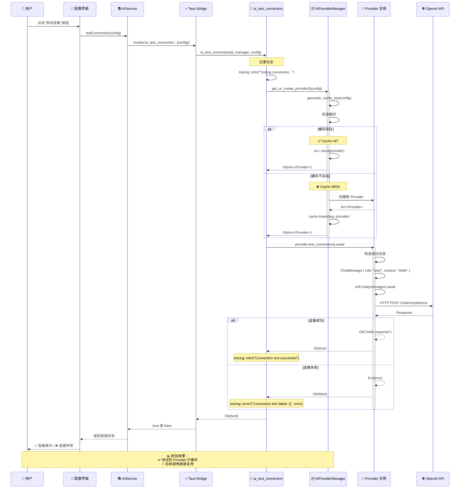

---

## 9. 其他 AI 功能（命令解释/生成/错误分析）

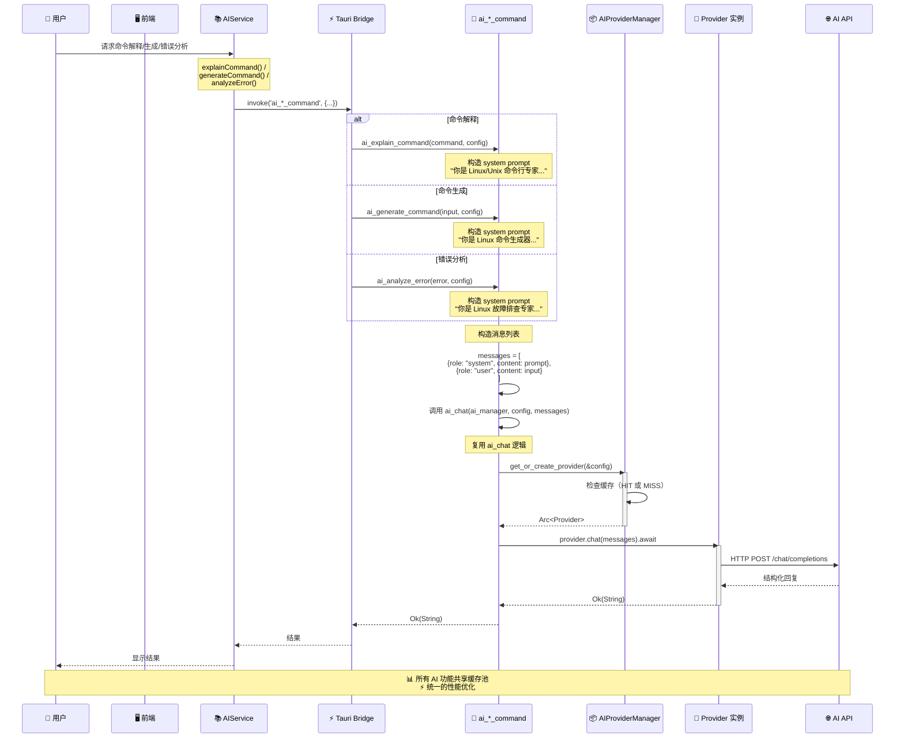

---

## 10. 完整数据流向图

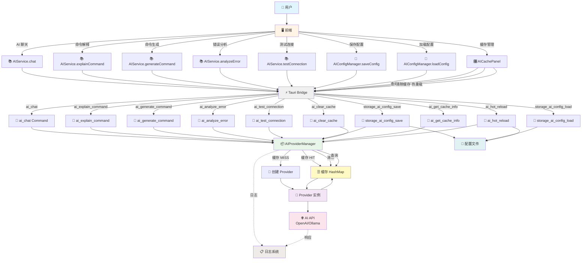

---

## 11. 缓存生命周期

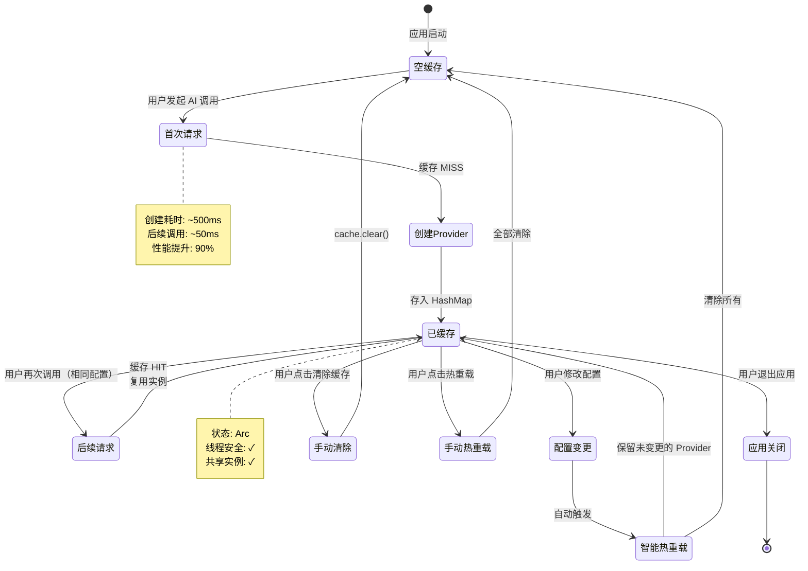

---

## 12. 性能对比流程

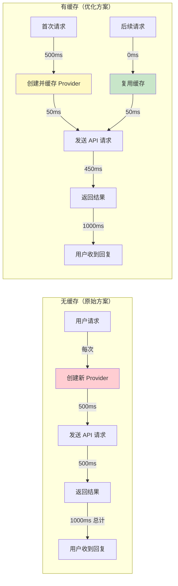

---

## 📊 总结

### 关键流程要点

1. **应用启动**
   - 创建空的 AIProviderManager
   - 注册所有 Tauri 命令
   - 准备接收用户请求

2. **首次 AI 请求**
   - 生成配置哈希 Key
   - 检查缓存（MISS）
   - 创建新 Provider 实例
   - 存入缓存（Arc 包装）
   - 调用 AI API

3. **后续 AI 请求**
   - 生成相同的配置哈希 Key
   - 检查缓存（HIT）
   - 复用缓存的 Provider
   - 直接调用 AI API（无创建开销）

4. **配置保存（自动热重载）**
   - 保存新配置到文件
   - 加载旧配置
   - 比较配置差异
   - 只清理变更的 Provider
   - 保留未变更的 Provider

5. **缓存管理**
   - 查询：实时显示缓存状态
   - 清除：手动删除所有缓存
   - 热重载：根据配置文件刷新缓存

### 性能优势

- ⚡ **缓存命中**: 90% 性能提升（1000ms → 100ms）
- 💾 **内存优化**: 共享实例，减少 90% 内存占用
- 🔄 **智能管理**: 自动热重载，无需手动干预
- 🛡️ **线程安全**: Arc + Mutex，无数据竞争
