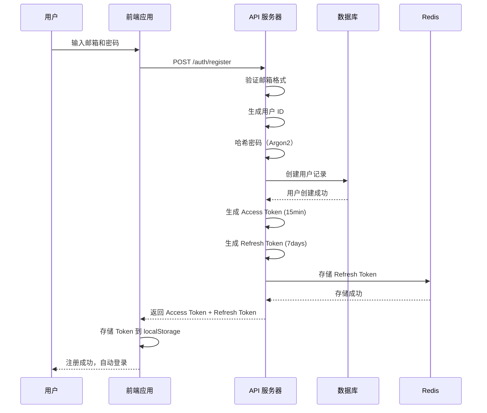
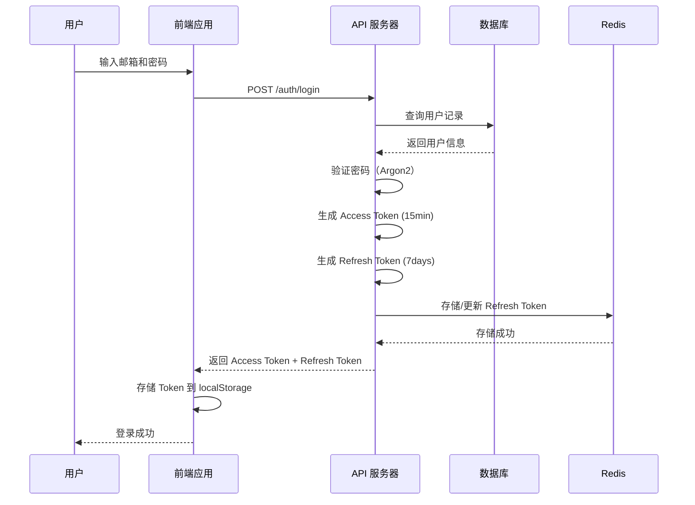
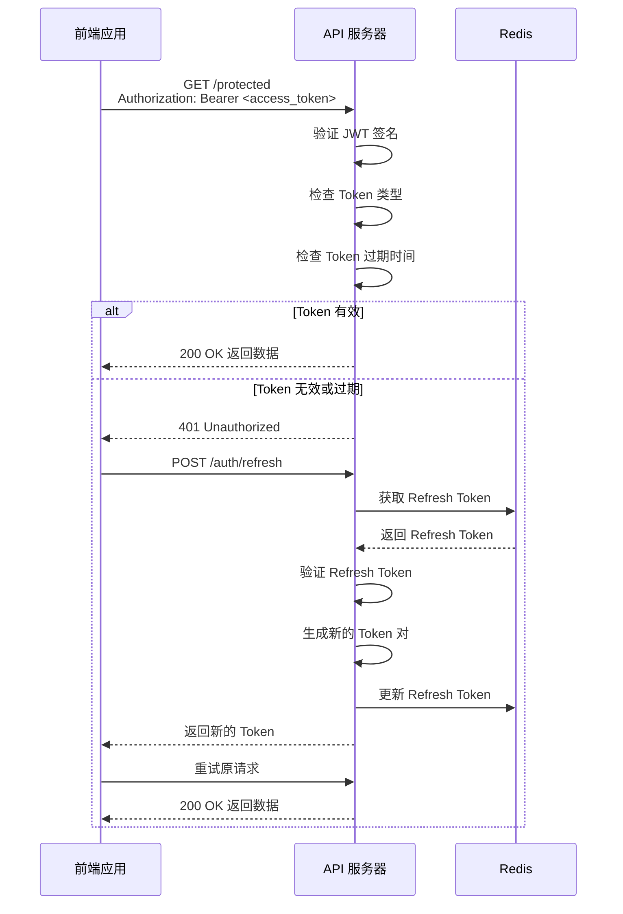
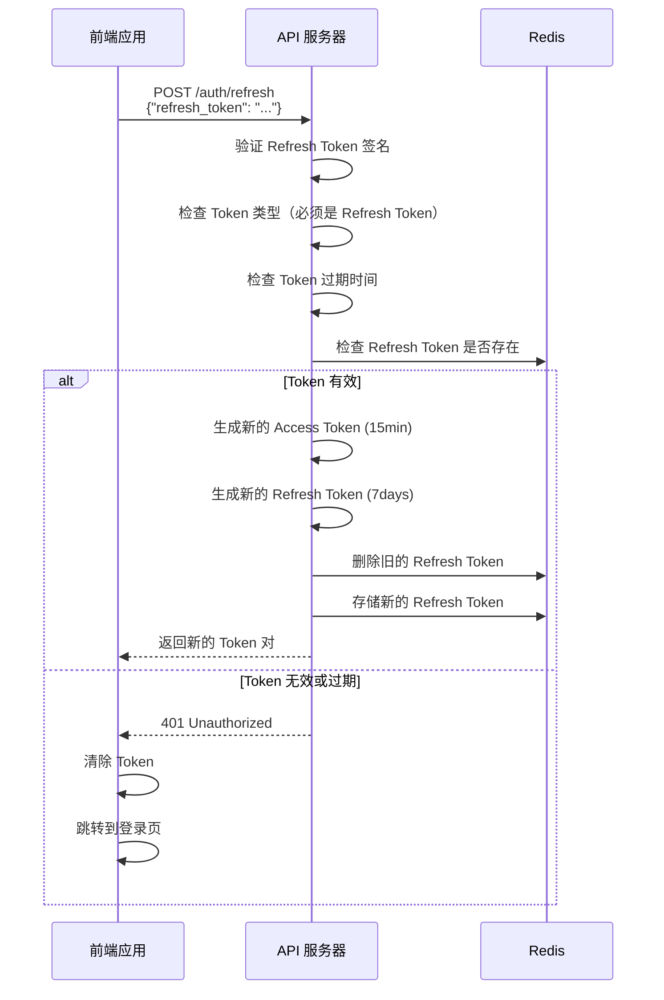
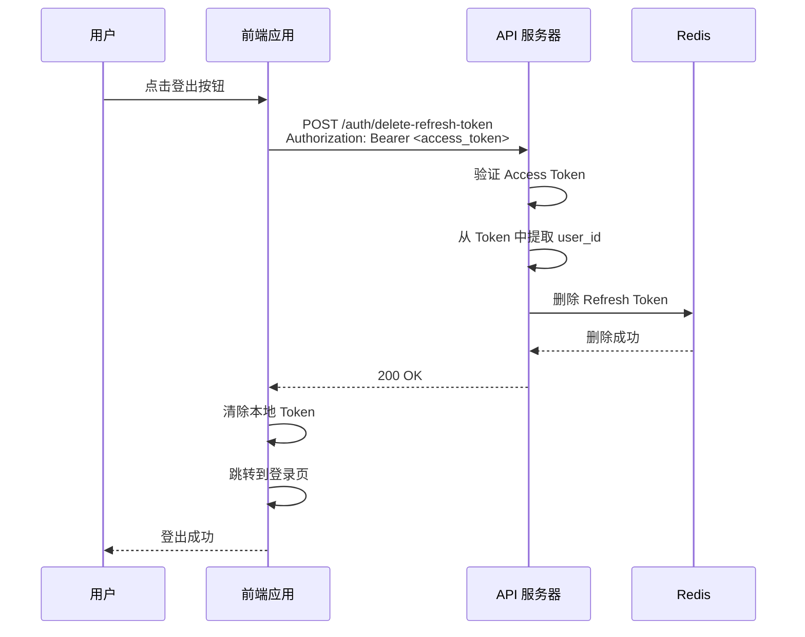

# 认证机制详解

本文档详细说明 SSH Terminal Server 的 JWT 认证机制、安全特性和最佳实践。

## 目录

- [认证架构概述](#认证架构概述)
- [双 Token 机制](#双-token-机制)
- [认证流程](#认证流程)
- [Token 管理](#token-管理)
- [安全特性](#安全特性)
- [最佳实践](#最佳实践)

---

## 认证架构概述

本系统采用 **JWT (JSON Web Token)** 进行用户认证，使用 **双 Token 机制**：

1. **Access Token**：短期有效，用于 API 请求认证
2. **Refresh Token**：长期有效，用于获取新的 Access Token

### 架构特点

- ✅ **无状态认证**：服务器不存储会话信息，易于扩展
- ✅ **安全性**：Token 泄露影响可控，自动过期
- ✅ **用户体验**：Refresh Token 可减少用户登录次数
- ✅ **可撤销性**：通过 Redis 存储 Refresh Token，支持主动撤销

---

## 双 Token 机制

### Access Token

**用途**：访问需要认证的 API 接口

**特点**：
- 有效期：15 分钟（可配置）
- 包含用户 ID 和 Token 类型信息
- 不存储在服务器端（无状态）
- 每次请求都通过 HTTP Header 传递

**格式**：
```http
Authorization: Bearer <access_token>
```

### Refresh Token

**用途**：获取新的 Access Token

**特点**：
- 有效期：7 天（可配置）
- 存储在 Redis 中
- 支持撤销和主动登出
- 每次刷新会生成新的 Refresh Token

**存储位置**：
- 前端：localStorage 或 sessionStorage
- 后端：Redis（Key：`auth:refresh_token:<user_id>`）

---

## 认证流程

### 1. 用户注册流程



**关键点**：
- 密码使用 Argon2 算法哈希，不可逆
- Refresh Token 存储在 Redis，支持撤销
- 注册成功后自动登录，返回 Token

### 2. 用户登录流程



**安全特性**：
- 登录失败不返回具体错误信息（防止账号枚举）
- 密码错误会记录日志用于风控
- Refresh Token 每次登录都会更新

### 3. 访问受保护接口流程



**关键点**：
- 所有受保护接口都需要在 Header 中携带 Access Token
- Token 过期时前端自动刷新并重试请求
- 刷新成功后旧 Refresh Token 立即失效

### 4. Token 刷新流程



**Token 轮换**：
- 每次刷新都会生成新的 Refresh Token
- 旧的 Refresh Token 立即失效
- 防止 Token 重放攻击

### 5. 用户登出流程



---

## Token 管理

### Token 生成

```rust
// src/utils/jwt.rs

// 生成 Access Token
pub fn generate_access_token(
    user_id: &str,
    expiration_minutes: u64,
    jwt_secret: &str,
) -> Result<String> {
    let expiration = Utc::now()
        .checked_add_signed(Duration::minutes(expiration_minutes as i64))
        .expect("invalid expiration timestamp")
        .timestamp() as usize;

    let claims = Claims {
        sub: user_id.to_string(),
        exp: expiration,
        token_type: TokenType::Access,
    };

    let token = encode(
        &Header::default(),
        &claims,
        &EncodingKey::from_secret(jwt_secret.as_ref()),
    )?;

    Ok(token)
}

// 生成 Refresh Token
pub fn generate_refresh_token(
    user_id: &str,
    expiration_days: i64,
    jwt_secret: &str,
) -> Result<String> {
    let expiration = Utc::now()
        .checked_add_signed(Duration::days(expiration_days))
        .expect("invalid expiration timestamp")
        .timestamp() as usize;

    let claims = Claims {
        sub: user_id.to_string(),
        exp: expiration,
        token_type: TokenType::Refresh,
    };

    let token = encode(
        &Header::default(),
        &claims,
        &EncodingKey::from_secret(jwt_secret.as_ref()),
    )?;

    Ok(token)
}
```

### Token 验证

```rust
// src/infra/middleware/auth.rs

pub async fn auth_middleware(
    State(state): State<AppState>,
    mut request: Request,
    next: Next,
) -> Result<Response, ErrorResponse> {
    // 1. 提取 Authorization header
    let auth_header = request
        .headers()
        .get("Authorization")
        .and_then(|h| h.to_str().ok())
        .ok_or_else(|| ErrorResponse::new("缺少 Authorization header".to_string()))?;

    // 2. 验证 Bearer 格式
    if !auth_header.starts_with("Bearer ") {
        return Err(ErrorResponse::new("Authorization header 格式错误".to_string()));
    }

    let token = &auth_header[7..]; // 跳过 "Bearer "

    // 3. 验证 JWT 签名和过期时间
    let claims = decode_token(token, &state.config.auth.jwt_secret)?;

    // 4. 检查 Token 类型（必须是 Access Token）
    if claims.token_type != TokenType::Access {
        return Err(ErrorResponse::new("Token 类型错误".to_string()));
    }

    // 5. 将 user_id 添加到请求扩展中
    let user_id = claims.sub;
    request.extensions_mut().insert(user_id);

    // 6. 继续处理请求
    Ok(next.run(request).await)
}
```

### Refresh Token 存储

```rust
// src/services/auth_service.rs

async fn save_refresh_token(&self, user_id: &str, refresh_token: &str, expiration_days: i64) -> Result<()> {
    let key = RedisKey::new(BusinessType::Auth)
        .add_identifier("refresh_token")
        .add_identifier(user_id);

    let expiration_seconds = expiration_days * 24 * 3600;

    self.redis_client
        .set_ex(&key.build(), refresh_token, expiration_seconds as u64)
        .await
        .map_err(|e| anyhow::anyhow!("Redis 保存失败: {}", e))?;

    Ok(())
}
```

**Redis Key 设计**：
```
auth:refresh_token:<user_id>
```

**过期时间**：7 天（与 Refresh Token 有效期一致）

---

## 安全特性

### 1. 密码安全

**Argon2 哈希**：
- 使用 Argon2 算法（内存 hard，抗 GPU/ASIC 破解）
- 自动生成随机盐值
- 哈希结果不可逆

```rust
// src/services/auth_service.rs

pub fn hash_password(&self, password: &str) -> Result<String> {
    let salt = SaltString::generate(&mut OsRng);
    let argon2 = Argon2::default();
    let password_hash = argon2
        .hash_password(password.as_bytes(), &salt)
        .map_err(|e| anyhow::anyhow!("密码哈希失败: {}", e))?
        .to_string();
    Ok(password_hash)
}
```

### 2. JWT 安全

**签名算法**：HS256 (HMAC-SHA256)

**Claims 结构**：
```rust
pub struct Claims {
    pub sub: String,        // 用户 ID
    pub exp: usize,        // 过期时间（Unix 时间戳）
    pub token_type: TokenType,  // Token 类型（Access/Refresh）
}
```

**安全措施**：
- 使用强密钥（至少 32 位随机字符串）
- Token 包含过期时间
- Token 类型区分（防止混用）
- 签名验证防止篡改

### 3. Refresh Token 安全

**存储安全**：
- 存储在 Redis 中，支持快速撤销
- 每次刷新生成新 Token，旧 Token 失效
- 支持主动登出，删除 Refresh Token

**使用限制**：
- Refresh Token 只能使用一次
- 过期后无法续期
- 需要重新登录

### 4. 防护措施

**防重放攻击**：
- Refresh Token 单次使用
- 刷新后立即失效

**防 Token 泄露**：
- Access Token 短期有效（15 分钟）
- 只通过 HTTPS 传输
- 不在 URL 中传递

**防暴力破解**：
- 限制登录频率（可选实现）
- 记录失败尝试（日志）
- 密码哈希使用 Argon2

---

## 最佳实践

### 前端集成

#### 1. Token 存储

**推荐方案**：
```typescript
// 存储 Token
localStorage.setItem('access_token', access_token);
localStorage.setItem('refresh_token', refresh_token);

// 读取 Token
const accessToken = localStorage.getItem('access_token');
const refreshToken = localStorage.getItem('refresh_token');

// 清除 Token
localStorage.removeItem('access_token');
localStorage.removeItem('refresh_token');
```

#### 2. 请求拦截器

```typescript
// 添加 Token 到请求头
api.interceptors.request.use((config) => {
  const accessToken = localStorage.getItem('access_token');
  if (accessToken) {
    config.headers.Authorization = `Bearer ${accessToken}`;
  }
  return config;
});
```

#### 3. 响应拦截器（自动刷新 Token）

```typescript
// 处理 401 错误并自动刷新
api.interceptors.response.use(
  (response) => response,
  async (error) => {
    const originalRequest = error.config;

    if (error.response?.status === 401 && !originalRequest._retry) {
      originalRequest._retry = true;

      try {
        const refreshToken = localStorage.getItem('refresh_token');
        const response = await axios.post('/auth/refresh', {
          refresh_token: refreshToken,
        });

        const { access_token, refresh_token } = response.data.data;

        localStorage.setItem('access_token', access_token);
        localStorage.setItem('refresh_token', refresh_token);

        // 重试原请求
        originalRequest.headers.Authorization = `Bearer ${access_token}`;
        return axios(originalRequest);
      } catch (refreshError) {
        // 刷新失败，跳转登录页
        localStorage.clear();
        window.location.href = '/login';
        return Promise.reject(refreshError);
      }
    }

    return Promise.reject(error);
  }
);
```

### 后端开发

#### 1. 密码强度要求

```rust
// 验证密码强度
fn validate_password(password: &str) -> Result<()> {
    if password.len() < 8 {
        return Err(anyhow!("密码长度至少 8 位"));
    }
    if password.len() > 100 {
        return Err(anyhow!("密码长度最多 100 位"));
    }
    // 可添加更多规则（如必须包含大小写、数字等）
    Ok(())
}
```

#### 2. JWT 密钥管理

**开发环境**：

使用 `config/` 目录下的配置文件：

```bash
# 方式1：使用默认配置（推荐）
# JWT 密钥已在 config/default.toml 中配置

# 方式2：创建本地配置文件
cp config/default.toml config/local.toml
# 编辑 config/local.toml，修改 jwt_secret
nano config/local.toml

# 运行
cargo run -- -c config/local.toml
```

**生产环境**：
```bash
# 使用强随机密钥
AUTH_JWT_SECRET=$(openssl rand -base64 32)
```

#### 3. Token 过期时间配置

```bash
# Access Token：15 分钟（推荐）
AUTH_ACCESS_TOKEN_EXPIRATION_MINUTES=15

# Refresh Token：7 天（推荐）
AUTH_REFRESH_TOKEN_EXPIRATION_DAYS=7
```

**建议**：
- Access Token：5-30 分钟（权衡安全性和用户体验）
- Refresh Token：7-30 天（根据应用安全要求）

### 生产部署

#### 1. HTTPS 强制

```nginx
server {
    listen 80;
    server_name api.yourdomain.com;
    return 301 https://$server_name$request_uri;
}

server {
    listen 443 ssl;
    server_name api.yourdomain.com;
    # SSL 配置...
}
```

#### 2. CORS 配置

开发环境可以允许所有来源：

```rust
CorsLayer::new()
    .allow_origin(Any)
    .allow_methods(Any)
    .allow_headers(Any)
```

生产环境应该限制允许的来源：

```rust
CorsLayer::new()
    .allow_origin("https://yourdomain.com".parse::<HeaderValue>().unwrap())
    .allow_methods([Method::GET, Method::POST, Method::PUT, Method::DELETE])
    .allow_headers([HeaderName::from_static("content-type"), HeaderName::from_static("authorization")])
```

#### 3. 速率限制

防止暴力破解和 DDoS 攻击（需要额外实现）：

```rust
// 使用 governor 库实现速率限制
use governor::{Quota, RateLimiter};

let limiter = RateLimiter::direct(Quota::per_second(5));
// 每秒最多 5 个请求
```

---

## 相关文档

- [公开接口文档](endpoints/public.md) - 注册、登录、刷新 Token 接口
- [受保护接口文档](endpoints/protected.md) - 需要认证的接口
- [前端集成示例](examples/frontend-integration.md) - 完整的前端集成代码
- [环境变量配置](../deployment/environment-variables.md) - 认证相关配置说明

---

**提示**：生产环境部署前务必修改 JWT 密钥为强随机字符串！
